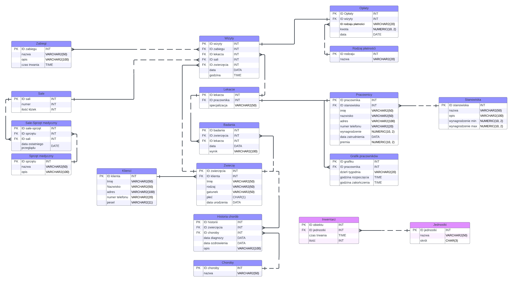

# Bazy Danych 2 - projekt kliniki weterynaryjnej
**Zespół 31.:** Magdalena Dudek, Kinga Świderek, Jan Hapunik, Jakub Kowalczyk

## Opis 
W ramach projektu zamodelowaliśmy system do efektywnego prowadzenia przychodni weterynaryjnej z poziomu menedżera bądź recepcjonisty. System będzie składał się z kilku modułów, które pozwolą na łatwe zarządzanie pacjentami, wizytami, kadrami pracowniczymi, a także pozwolą na monitorowanie grafików sal zabiegowych, rodzajów badań czy przepisanych recept.

Moduł zarządzania pacjentami pozwoli na dodawanie i edycję informacji o zwierzętach, w tym danych właściciela, historii chorób i przebiegu leczenia. Będzie również umożliwiał generowanie raportów o pacjentach, w tym o najczęstszych chorobach, przepisanych lekach czy zabiegach. Dzięki temu lekarz skróci czas wywiadu z pacjentem; zwierzę uzyska szybszą, fachową pomoc sprawdzonymi metodami; a recepcjonista uzyska ułatwiony dostęp do informacji w jednym miejscu i będzie mógł je z łatwością skorygować po rozmowie z klientem.

Moduł wizyt pozwoli na łatwe rezerwowanie terminów wizyt przez pracowników przychodni podczas kontaktu telefonicznego z pacjentem. Opcjonalnie, wprowadzimy również system rezerwacji online samym klientom, którzy w wygodny sposób mogliby dokonać przełożenia czy odwołania wizyty. Lekarz przy każdej wizycie będzie mógł zapisać notatki, wyniki badań i zalecone leki, które zostaną przekazane klientowi w formie raportu wraz z automatycznie utworzoną fakturą za usługi. 

Moduł zarządzania kadrami umożliwi rozporządzanie harmonogramem pracy pracowników, rewizję ich dostępności oraz przypisywanie im konkretnych obowiązków. Dzięki wygenerowanym danym o czasie pracy, liczbie zrealizowanych świadczeń i ogólnej satysfakcji klientów, menedżer będzie mógł sprawiedliwie przyznać nagrody lub podwyżki pensji. 

Moduł zarządzania zaopatrzeniem będzie odpowiadał za kontrolę stanu i ilości narzędzi, opatrunków i substancji potrzebnych do wykonania zabiegów weterynaryjnych, a także umożliwi odpowiednie rozlokowanie inwentarza w różnych salach operacyjnych.

System będzie dostępny z poziomu przeglądarki internetowej, co pozwoli na łatwe i szybkie korzystanie z niego z dowolnego miejsca i urządzenia.

# Model pojęciowy

