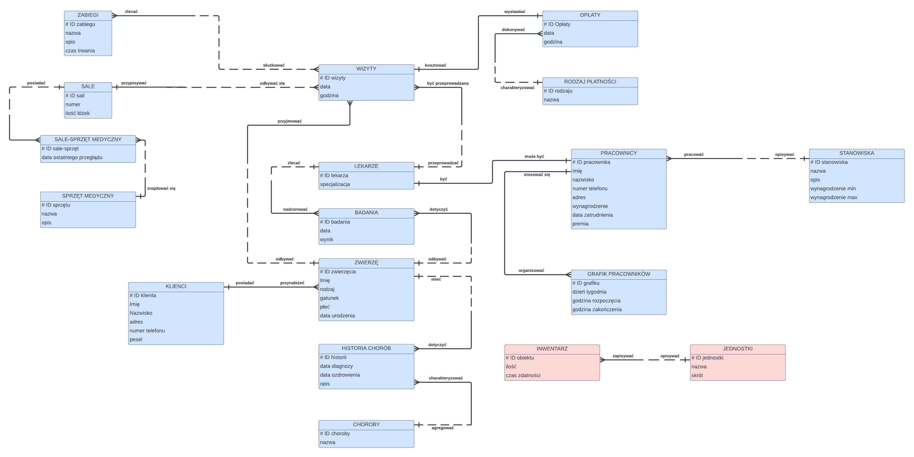
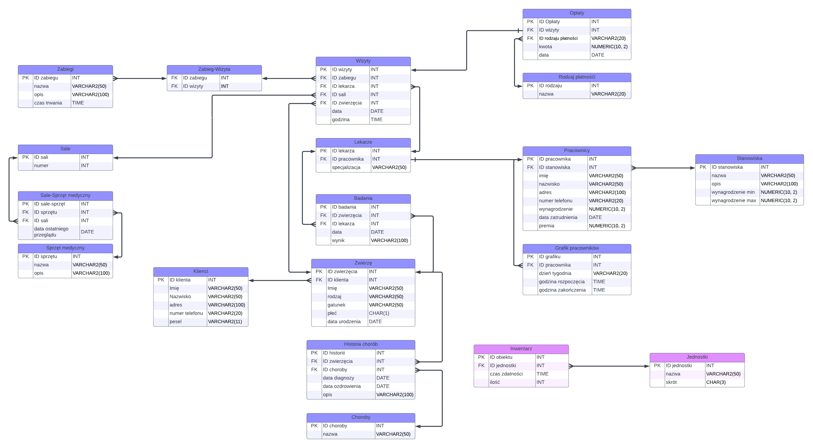

# Bazy Danych 2 - projekt kliniki weterynaryjnej
**Zespół 31.:** Magdalena Dudek, Kinga Świderek, Jan Hapunik, Jakub Kowalczyk

## Opis 
W ramach projektu zamodelowaliśmy system do efektywnego prowadzenia przychodni weterynaryjnej z poziomu menedżera bądź recepcjonisty. System będzie składał się z kilku modułów, które pozwolą na łatwe zarządzanie pacjentami, wizytami, kadrami pracowniczymi, a także pozwolą na monitorowanie grafików sal zabiegowych, rodzajów badań czy przepisanych recept.

Moduł zarządzania pacjentami pozwoli na dodawanie i edycję informacji o zwierzętach, w tym danych właściciela, historii chorób i przebiegu leczenia. Będzie również umożliwiał generowanie raportów o pacjentach, w tym o najczęstszych chorobach, przepisanych lekach czy zabiegach. Dzięki temu lekarz skróci czas wywiadu z pacjentem; zwierzę uzyska szybszą, fachową pomoc sprawdzonymi metodami; a recepcjonista uzyska ułatwiony dostęp do informacji w jednym miejscu i będzie mógł je z łatwością skorygować po rozmowie z klientem.

Moduł wizyt pozwoli na łatwe rezerwowanie terminów wizyt przez pracowników przychodni podczas kontaktu telefonicznego z pacjentem. Opcjonalnie, wprowadzimy również system rezerwacji online samym klientom, którzy w wygodny sposób mogliby dokonać przełożenia czy odwołania wizyty. Lekarz przy każdej wizycie będzie mógł zapisać notatki, wyniki badań i zalecone leki, które zostaną przekazane klientowi w formie raportu wraz z automatycznie utworzoną fakturą za usługi. 

Moduł zarządzania kadrami umożliwi rozporządzanie harmonogramem pracy pracowników, rewizję ich dostępności oraz przypisywanie im konkretnych obowiązków. Dzięki wygenerowanym danym o czasie pracy, liczbie zrealizowanych świadczeń i ogólnej satysfakcji klientów, menedżer będzie mógł sprawiedliwie przyznać nagrody lub podwyżki pensji. 

Moduł zarządzania zaopatrzeniem będzie odpowiadał za kontrolę stanu i ilości narzędzi, opatrunków i substancji potrzebnych do wykonania zabiegów weterynaryjnych, a także umożliwi odpowiednie rozlokowanie inwentarza w różnych salach operacyjnych.

System będzie dostępny z poziomu przeglądarki internetowej, co pozwoli na łatwe i szybkie korzystanie z niego z dowolnego miejsca i urządzenia.

# Model ER

# Model logiczny

# Wstępne założenia projektowe:

1. **Personel.** Dostęp do systemu posiadają zatrudnieni w klinice lekarze, recepcjoniści (konsultanci telefoniczni) i menedżer. Wszyscy posiadają do wglądu i możliwości edycji informacje o wizytach wraz z opłatami oraz zwierzętach i ich właścicielach. Wszyscy (recepcjonista tylko na prośbę lekarza) mogą zarządzać stanem zaplecza medycznego (stan leków, zaopatrzenie sal, sprzęt medyczny). Tylko menedżer może modyfikować grafik innych pracowników i przyznawać im pensje. Właściciel kliniki posiada dostęp na prawach menedżera.
2. **Klienci.** Aby umówić się na wizytę klienci kontaktują się telefonicznie z konsultantem - recepcjonistą, który to zapisuje ich dane do systemu. Oczywiście, istnieje możliwość wprowadzenia danych podczas rozmowy stacjonarnie. System jest użytkowany przez wyszkoloną osobę, więc klient nie posiada do niego dostępu (opcjonalnie zostanie wprowadzony moduł z informacjami i umawianiem wizyty online przez klienta). Klient może posiadać kilka zwierząt zapisanych w klinice.
3. **Wizyty.** Aby zachować spójność danych każda wizyta musi mieć przypisanego lekarza, numer sali, konkretne zwierzę, datę i godzinę, a także rodzaj zabiegów (może być to zwykła konsultacja lub badanie przeglądowe). Każdy lekarz ma przypisaną specjalizację, która powinna być konsekwentna z rodzajem leczonego zwierzęcia (dopuszcza się wyjątki). Każde zwierzę ma swoją historię chorób, w której znajduje się nazwa, opis choroby, data diagnozy i data ozdrowienia. Data ozdrowienia jest opcjonalna i poglądowa - nie zawsze da się ją ewidencjonować, np. w przypadku gdy zwierzę wyleczy się kilka dni po przepisaniu leków w warunkach domowych.
4. **Sale i sprzęt medyczny.** Poza zwykłymi badaniami, w klinice wykonuje się poważniejsze zabiegi i operacje, które wymagają odpowiednich narzędzi (noże, szczypce, strzykawki, inna aparatura medyczna). Lekarz przed przystąpieniem do zabiegu może sprawdzić stan zaopatrzenia odpowiedniej sali, do której na stałe przypisane są odpowiednie przedmioty. Po zakończonej operacji w przypadku zużycia jakiegoś materiału bądź uszkodzenia fizycznego sprzętu, lekarz musi zaktualizować stan w systemie lub zlecić to pracownikowi na recepcji. W przypadku przeniesienia rzeczy, również należy ręcznie uaktualnić jego przynależność. Raz na jakiś czas odbywa się przegląd techniczny w obecności menedżera, dlatego posiada on możliwość edytowania stanu sprzętu.
5. **Inwentarz.** Poza sprzętem na salach zabiegowych, istnieje jeden centralny magazyn, w którym przechowuje się zapasy leków, opatrunków, kroplówek i monitoruje się ich ilościowy stan. W przypadku gdy klient podczas wizyty otrzymuje lek, stan inwentarza jest automatycznie pomniejszany. Gdy lekarz wyciąga z magazynu rzeczy potrzebne do zabiegu bądź wyrzuca przeterminowane leki powinien ręcznie zaktualizować jego stan (lub zlecić to innemu pracownikowi).
6. **Opłaty.** Każda wizyta ma przypisany konkretny zabieg i leki, dzięki czemu wiadomo ile będzie kosztować. Po zakończonych badaniach, na podstawie wcześniej wprowadzonych danych, generowana jest faktura na osobę fizyczną. Nie ma możliwości wystawienia faktury na firmę. Istnieją 4 metody płatności: gotówką, kartą, BLIKiem lub voucherem.
7. **Grafik pracowników.** Każdy pracownik ma przypisany przedział godzinowy pracy w danym dniu tygodnia. Klinika jest otwarta we wszystkie dni poza niedzielami i świętami państwowymi (jeżeli takie wypadnie w dzień powszedni - pracownik wie, że ma wolne i nie stosuje się do harmonogramu). Grafik jest zarządzany wyłącznie przez menedżera tak samo jak informacje o pracownikach takie jak wypłaty i premie.

## Wymagania funkcjonalne:
1. **Zarządzanie pacjentami** - system powinien umożliwiać dodawanie, edycję i usuwanie informacji o pacjentach (np. imię, wiek, rasa, historia chorób, itp.).
2. **Zarządzanie personelem** - system powinien umożliwiać zarządzanie listą pracowników, monitorowanie ich obecności i pracy, a także generowanie raportów związanych z pracą personelu.
3. **Terminarz** - system powinien umożliwiać zarządzanie terminami wizyt pacjentów, tak aby recepcjonista mógł łatwo przeglądać dostępne terminy i umawiać wizyty do konkretnych weterynarzy, biorąc pod uwagę ich dostępność. Powinna również istnieć funkcjonalność przypominająca o nadchodzących wizytach.
4. **Zarządzanie leczeniem** - system powinien umożliwiać przeglądanie historii chorób, aktualnych dolegliwości pacjenta i planu leczenia – potrzebnych zabiegów i farmakoterapii.
5. **Zarządzanie zapasami** - system powinien umożliwiać śledzenie stanów zapasów leków i sprzętu weterynaryjnego. Menedżer powinien mieć dostęp do funkcjonalności umożliwiającej przeglądanie stanów zapasów i aktualizowanie ich w razie potrzeby.
6. **Zarządzanie finansami** - system powinien umożliwiać tworzenie faktur i prowadzenie rozliczeń z klientami. Menedżer powinien mieć dostęp do funkcjonalności umożliwiającej przeglądanie historii rozliczeń i zarządzanie fakturami.
7. **Raportowanie** - system powinien umożliwiać generowanie raportów z różnych obszarów działalności przychodni (np. liczba pacjentów, ilość wizyt, sprzedaż, itp.). Raporty powinny być dostępne dla menedżera w celu monitorowania efektywności działalności.

## Wymagania niefunkcjonalne:
1. **Wydajność** - System powinien być wydajny i działać płynnie, nawet przy dużej ilości użytkowników i danych. Nie powinno być opóźnień ani awarii, które wpłyną na jakość obsługi pacjentów i wydajność personelu.
2. **Dostępność** - System powinien być łatwo dostępny z różnych urządzeń i miejsc, aby personel przychodni mógł uzyskać do niego dostęp w dowolnym czasie i miejscu. Powinien być dostępny przez przeglądarkę internetową na każdym urządzeniu.
3. **Intuicyjność i łatwość obsługi** - System powinien być łatwy w obsłudze, a interfejs użytkownika powinien być intuicyjny i przyjazny dla użytkownika. Personel powinien łatwo znajdować potrzebne funkcje i korzystać z nich bez problemów.
4. **Bezpieczeństwo fizyczne** - System powinien być chroniony przed zagrożeniami fizycznymi, takimi jak pożary, powodzie, kradzieże lub uszkodzenia sprzętu. Powinien być przechowywany w bezpiecznym miejscu i posiadać regularnie tworzone kopie zapasowe.
5. **Integracja z innymi systemami** - System powinien umożliwiać integrację z innymi systemami, takimi jak system księgowy, systemy do zarządzania magazynem i innymi. Umożliwi to płynne przepływanie informacji między różnymi systemami i usprawni procesy w przychodni.
6. **Dostęp do wsparcia technicznego** - System powinien być dostępny z pomocą techniczną dla personelu, który potrzebuje pomocy technicznej lub szkolenia w zakresie korzystania z systemu. Powinien być łatwy w utrzymaniu i dostępny z narzędziami do zarządzania błędami.

## Scenariusze testów:
**Moduł zarządzania pacjentami:**

**a.** Testowanie dodawania nowych pacjentów do bazy danych.

Sprawdzenie czy można poprawnie dodać informacje o zwierzęciu i jego właścicielu.
Upewnienie się, że historia chorób i przebieg leczenia są prawidłowo zapisane.

**b.** Testowanie edycji informacji o zwierzętach i ich właścicielach.
Zmiana danych właściciela i zwierzęcia i sprawdzenie, czy zmiany zostały zapisane poprawnie.

**c.** Testowanie generowania raportów o pacjentach, takich jak najczęstsze choroby, przepisane leki, zabiegi.

Wygenerowanie raportów o najczęstszych chorobach, przepisanych lekach i zabiegach i sprawdzenie, czy dane są dokładne i zgodne z oczekiwaniami.

**Moduł wizyt:**

**a.** Testowanie rezerwacji terminów wizyt.
- termin wizyty nie może być w przeszłości
- lekarz musi być w danym terminie dostępny (zgodnie z harmonogramem pracownika)
- lekarz nie może mieć w tym czasie innej wizyty

**b.** Testowanie możliwości przełożenia lub odwołania wizyty przez klienta.
- termin nie może być przełożony na przeszłość
- lekarz musi być w przełożonym czasie dostępny
- odwołanie wizyty skutkuje usunięciem z bazy danych powiązanych rekordów (płatność, umówione)

**c.** Testowanie zapisywania notatek, wyników badań i zaleconych leków przez lekarza.

**d.** Testowanie generowania raportów wraz z automatyczną fakturą za usługi.

**Moduł zarządzania kadrami:**

**a.** Testowanie rozporządzania harmonogramem pracy pracowników przez menedżera.

Próba tworzenia harmonogramu pracy i upewnienie się, że zmiany są poprawnie zapisywane.

**b.** Testowanie rewizji dostępności pracowników.

**c.** Testowanie przypisywania obowiązków do konkretnych pracowników.

Sprawdzenie, czy można przypisać konkretnym pracownikom odpowiednie obowiązki i upewnić się, że są one prawidłowo zapisane.

**d.** Testowanie przyznawania nagród lub podwyżek pensji na podstawie danych o czasie pracy, liczbie świadczeń i satysfakcji klientów.

**Moduł zarządzania zaopatrzeniem:**

**a.** Testowanie kontroli stanu i ilości narzędzi, opatrunków i substancji medycznych.

Sprawdzenie, czy system prawidłowo monitoruje stan narzędzi i informuje o potrzebie uzupełnienia zapasów.

**b.** Testowanie rozlokowania inwentarza w różnych salach operacyjnych.

Upewnienie się, że inwentarz jest poprawnie rozmieszczony w różnych salach operacyjnych.

**c.** Testowanie aktualizacji stanu sprzętu po operacji lub przeniesieniu przedmiotów.

**d.** Testowanie możliwości edycji stanu sprzętu przez menedżera.

**Integracja danych:**

**a.** Testowanie spójności danych dla każdej wizyty, zwierzęcia i właściciela.

**b.** Testowanie przypisywania właściwych lekarzy, numerów sal i rodzajów zabiegów do wizyt.

**c.** Testowanie aktualizacji danych w historii chorób zwierząt.

**Opłaty:**

**a.** Testowanie przypisywania odpowiednich kosztów do wizyt na podstawie przeprowadzonych zabiegów i leków.

**b.** Testowanie generowania faktur dla klientów na podstawie danych zakończonej wizyty.

**c.** Testowanie różnych metod płatności: gotówka, karta, BLIK, voucher.

**Grafik pracowników:**

**a.** Testowanie poprawności przypisywania przedziałów godzinowych pracy dla pracowników.

**b.** Testowanie uwzględniania dni wolnych, niedziel i świąt państwowych w harmonogramie pracy.

**c.** Testowanie zarządzania grafikiem pracy wyłącznie przez menedżera.

W przypadku każdego modułu testowego należy sprawdzić, czy interakcje między modułami działają poprawnie i przekazują prawidłowe dane. Należy również przetestować sytuacje wyjątkowe i obsługę błędów, takie jak próba dostępu do danych przez nieuprawnionego użytkownika, brak wymaganych pól w formularzach itp.

(możliwe do dodania :

**Testowanie bezpieczeństwa:**

**a.** Przeprowadzenie testów penetracyjnych, aby sprawdzić, czy system jest odporny na ataki zewnętrzne.

**b.** Testowanie mechanizmów uwierzytelniania i uprawnień, aby upewnić się, że dostęp do danych jest odpowiednio chroniony.

**Testowanie wydajności:**

**a.** Przeprowadzenie testów obciążeniowych, aby ocenić wydajność systemu podczas dużej liczby użytkowników i transakcji.

**b.** Sprawdzenie czasu odpowiedzi systemu i szybkości przetwarzania różnych operacji.

**Testowanie przywracania danych:**

**a.** Wykonanie testów przywracania danych po awarii systemu lub utracie połączenia, aby upewnić się, że dane są bezpieczne i można je przywrócić w przypadku problemów technicznych.

**Interfejs i dostęp:**

**a.** Testowanie dostępności systemu z poziomu przeglądarki internetowej.

**b.** Testowanie łatwości korzystania z systemu z różnych urządzeń.

**c.** Testowanie uprawnień dostępu dla personelu i właściciela kliniki.
)

